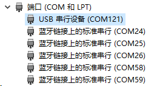

.. _online_flasher:

Online Flasher
======================

The online flasher tool allows you to flash firmware to your ESP32 device directly from the browser, without installing any development environment.

Prerequisites
---------------------

- Chrome or Edge browser installed (Web Serial API support required)
- ESP32 device connected to your computer via USB
- Serial port device recognized in Device Manager

.. note::
   If the device is not found in Device Manager, try using a different USB port.

Flashing Steps
---------------------

#. Open the online flasher: `LAFVIN Web Flasher <https://lafvintech.github.io/Lafvin_Web_Flasher/>`_

   .. image:: img/olf2.png

#. Select your kit or device model.for example, "ESP32S3 1.83 LCD".

   .. image:: img/olf3.png

#. Select the firmware to flash.In this kit, we have selected "Factory Firmware”

   .. image:: img/olf4.png

#. Select the firmware version.In this kit, we have selected “Factory Firmware”

   .. image:: img/olf5.png

#. Click ``Connect``. A serial port selection window will pop up in the upper-left corner of the browser (grant permission if prompted). Select your device and click connect. Once connected, the button will change to ``Disconnect``.

   .. image:: img/olf6.png

   .. image:: img/olf7.png

#. Select the ``Flash Baud Rate`` and whether to enable ``Erase Flash`` (recommended for first-time flashing). Once confirmed, click ``Flash``. The tool will automatically erase and write the selected firmware.

   .. image:: img/olf8.png

.. note::
   The Flash erase process may take a while. Please be patient.
