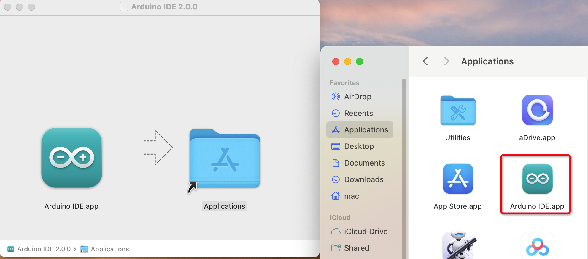
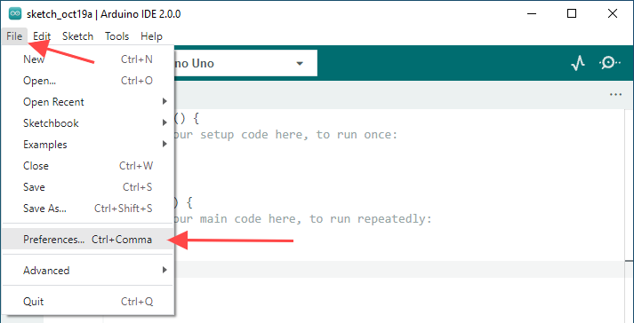
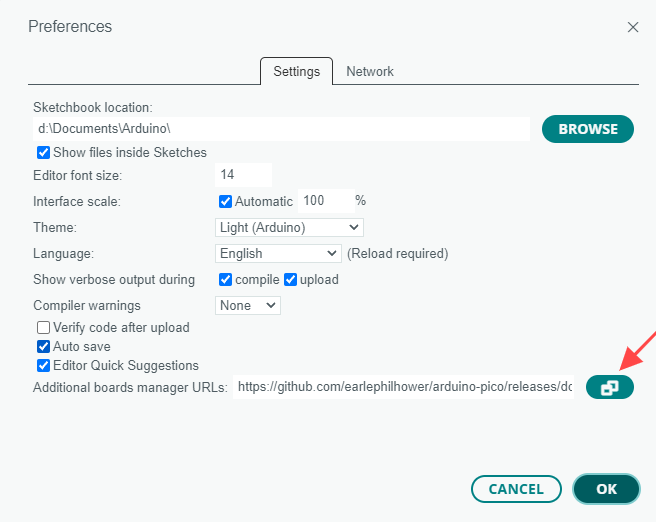
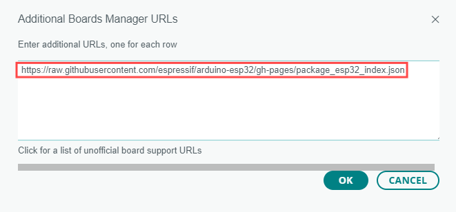
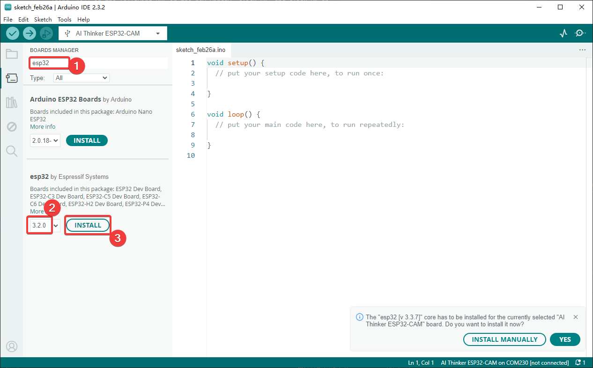
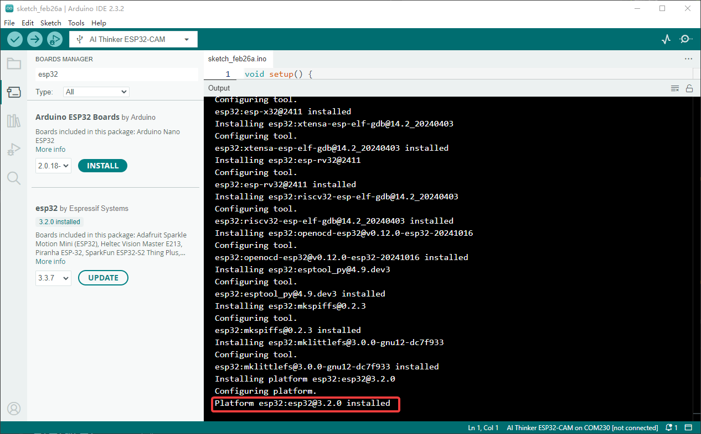
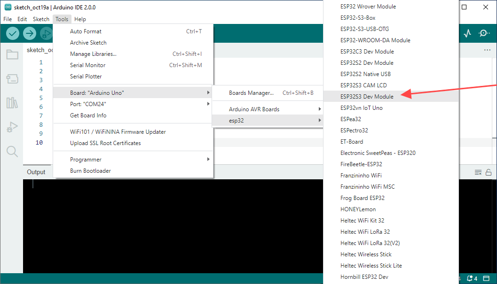
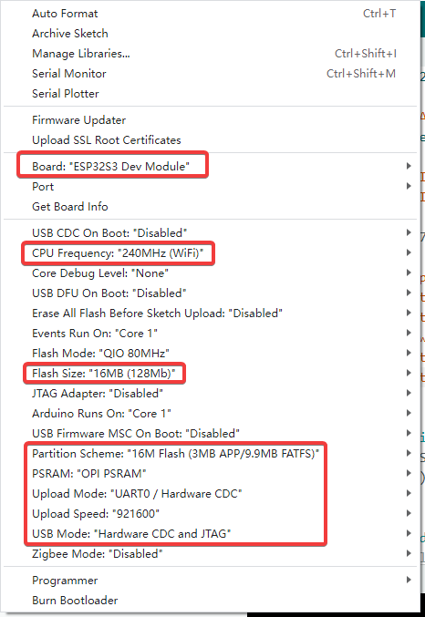

.. _install_arduino_ide:

Install Arduino IDE
===================

Download Arduino IDE 2.x
------------------------

#. Visit the `Arduino Software page <https://www.arduino.cc/en/software>`_.
#. Download the latest Arduino IDE 2.x release for your operating system.

   .. image:: img/Install_Arduino_IDE_1.png

Installation
------------

Windows
^^^^^^^

#. Double-click the downloaded ``arduino-ide_xxxx.exe`` file.
#. Read the license agreement and continue.

   .. image:: img/Install_Arduino_IDE_2.png

#. Choose the installation options.

   .. image:: img/Install_Arduino_IDE_3.png

#. Choose the installation location. Installing outside the system drive is recommended when possible.

   .. image:: img/Install_Arduino_IDE_4.png

#. Finish the installation.

   .. image:: img/Install_Arduino_IDE_5.png

macOS
^^^^^

Double-click the downloaded ``arduino_ide_xxxx.dmg`` file and copy **Arduino IDE.app** to the **Applications** folder.

Linux
^^^^^

For Linux installation instructions, refer to the official Arduino guide:
`Linux Installation Guide <https://docs.arduino.cc/software/ide-v2/tutorials/getting-started/ide-v2-downloading-and-installing#linux>`_

Open Arduino IDE
^^^^^^^^^^^^^^^^

#. When you open Arduino IDE for the first time, it automatically installs the built-in board packages and required files.

   .. image:: img/Install_Arduino_IDE_7.png

#. Your firewall or security software may ask whether to install drivers or allow access. Approve these prompts if needed.

   .. image:: img/Install_Arduino_IDE_8.png

#. Arduino IDE is now ready to use.

.. note::
   If some components fail to install because of a network problem, close and reopen Arduino IDE. It will continue the installation automatically.

Environment Configuration
-------------------------

First, open Arduino IDE, click **File > Preferences**, and find **Additional Boards Manager URLs**.

Click the icon next to that field.

Add the following URL, click **OK**, and then click **OK** again in the Preferences window.

   ``https://raw.githubusercontent.com/espressif/arduino-esp32/ghpages/package_esp32_index.json``

Open **Boards Manager**, search for ``esp32``, find **esp32 by Espressif Systems**, select version ``3.2.0``, and click **Install**.

Arduino IDE will download the required files automatically. Wait for the installation to complete.

.. warning::
   Install **esp32 by Espressif Systems** version ``3.2.0``. Other versions may compile successfully but can cause upload, USB, PSRAM, display, camera, or LVGL compatibility problems with this kit.

When the installation finishes, open **Tools > Board**, expand the ESP32 board list, and select ``ESP32S3 Dev Module``.

.. _arduino_board_settings:

Recommended Board Settings
--------------------------

For this kit, we recommend using the following Arduino IDE board settings for all tutorials unless a specific lesson says otherwise.

.. list-table::
   :header-rows: 1
   :widths: 35 45

   * - Setting
     - Recommended Value
   * - ESP32 Core Version
     - ``esp32 by Espressif Systems 3.2.0``
   * - Board
     - ``ESP32S3 Dev Module``
   * - CPU Frequency
     - ``240MHz (WiFi)``
   * - Flash Size
     - ``16MB (128Mb)``
   * - PSRAM
     - ``OPI PSRAM``
   * - Partition Scheme
     - ``16M Flash (3M APP/9.9M FATFS)``
   * - Upload Mode
     - ``UART0 / Hardware CDC``

These settings are recommended because this kit includes display, touch, camera, SD card, audio, and LVGL demos that require enough flash space, PSRAM, and a FATFS partition for larger examples.

.. note::
   If a tutorial does not mention a different configuration, use these settings by default.

For advanced users, the key Arduino CLI board configuration is::

   esp32:esp32:esp32s3:FlashSize=16M,PSRAM=opi,PartitionScheme=app3M_fat9M_16MB
