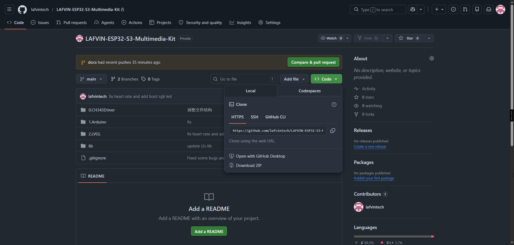
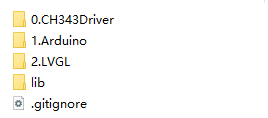

.. _download_code:

Download Code and Firmware
==========================

Download the product code package before opening the examples. The package
should contain the Arduino examples, ESP-IDF examples, firmware files, and
any local libraries required by the ESP32-S3 1.83-inch LCD Development Board.

You can visit our repository to download the code for our course this time.

`Code Repository <https://github.com/lafvintech/LAFVIN-ESP32-S3-Multimedia-Kit.git>`_

Alternatively, you can directly access this (link) in your browser, and it will automatically download the code as a ZIP file.

* :download:`Download Source Code (ZIP) <https://github.com/lafvintech/LAFVIN-ESP32-S3-Multimedia-Kit/archive/refs/heads/main.zip>`

After downloading and extracting the ZIP file, you should have the following four folders and a burn tool zip file.

