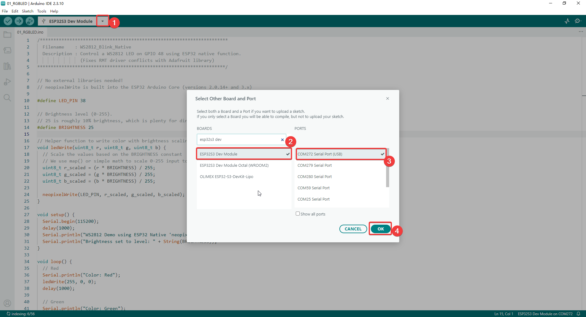
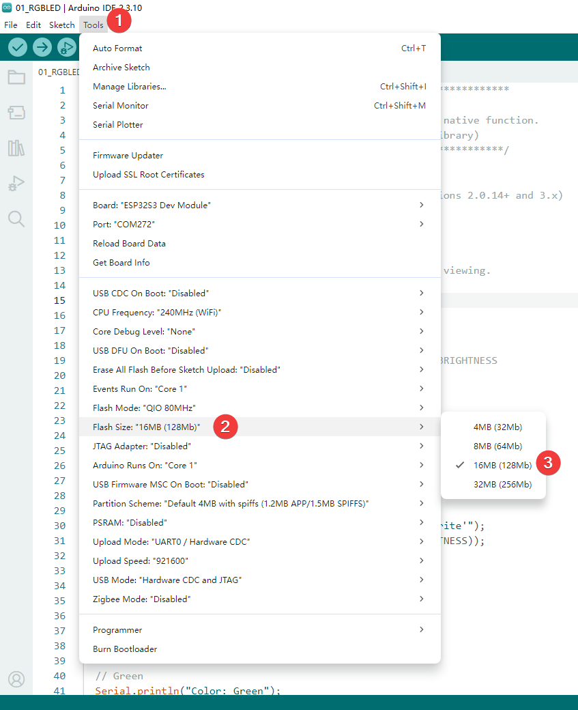
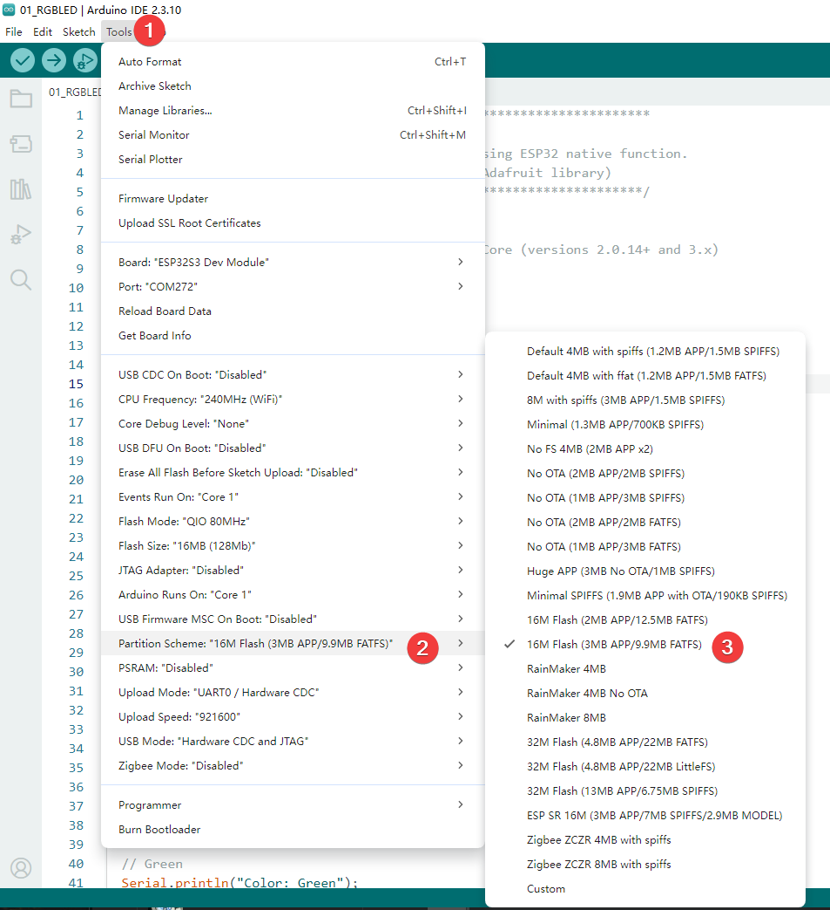
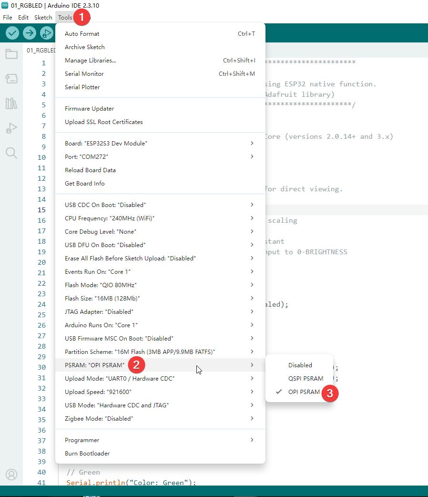
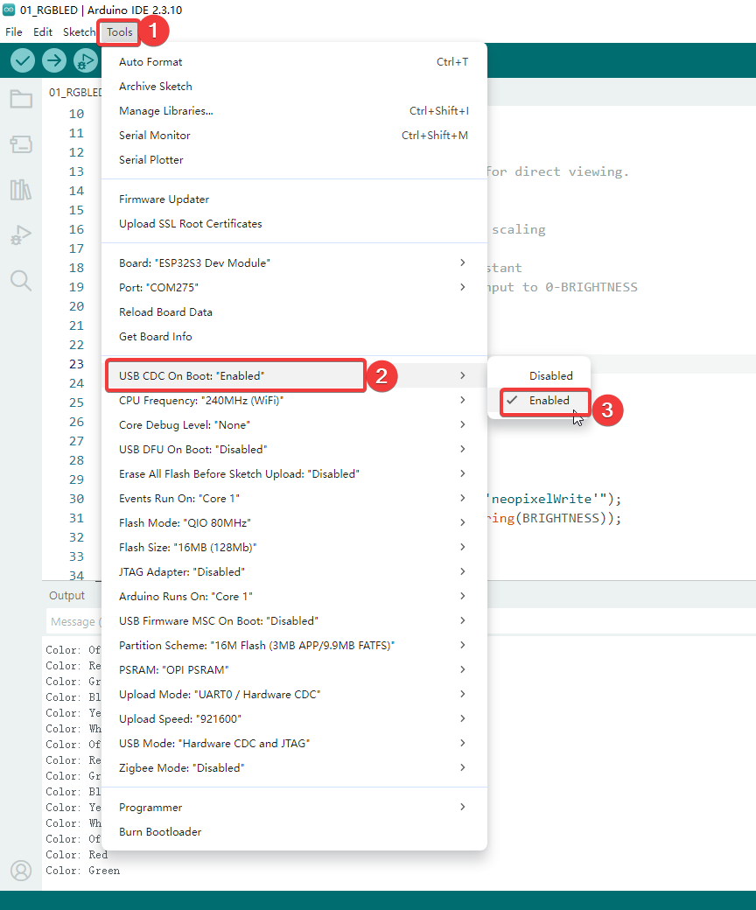
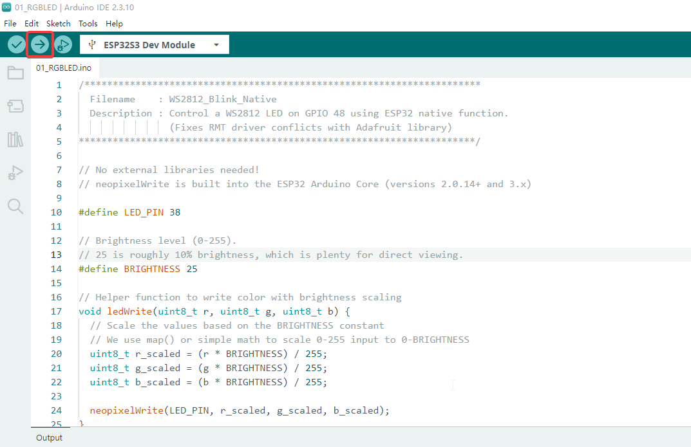

.. _arduino_tutorial:

2. Arduino
================

First, in this section, we need to download the Arduino IDE. You can follow the steps in the section below to install it.

:ref:`Install Arduino IDE <install_arduino_ide>`

After installing Arduino IDE and configuring the ESP32 board package according to this tutorial, we can install the libraries required for this project.

.. attention:: 
  The device requires a stable power supply. We recommend using an adapter rated at least 5V/2A or a standard USB 3.0 port; otherwise, the program may crash unexpectedly.

----

Installing Project Libraries
-----------------------------

请根据这个章节进行Arduino IDE的库安装。

----

Compile Arduino Project
-----------------------

Let's take the 01_HelloWorld project as an example. Double-click to open 01_HelloWorld.ino. The system will automatically open Arduino IDE. Then, set the port and board type as shown in the images below.

.. note:: 
   Make sure the development board is connected to the correct port. You can find the port number in Device Manager.

请根据下面的图片设置Flash Size, Partition Scheme, PSRAM, USB CDC On Boot等设置

After configuration, click the right arrow button in the upper left corner to start compiling and uploading.

.. attention::  
   Some programs use LVGL, which may take a long time, so please be patient

----

01_RGBLED
----------------

A WS2812 RGB LED blink demo using the ESP32 Arduino Core native
``neopixelWrite()`` function. The sketch controls the onboard RGB LED on
GPIO 38 and cycles through several colors to verify the Arduino upload process,
serial output, and onboard LED hardware.

Creates a simple RGB LED test sequence with:

- Red, green, blue, yellow, white, and off states
- 1 second delay between each state
- Brightness scaling through the ``BRIGHTNESS`` constant
- Serial Monitor output at ``115200`` baud

Hardware Connection
^^^^^^^^^^^^^^^^^^^

Use Type-C Cable connect the board to your computer.

Code Analysis
^^^^^^^^^^^^^

.. code-block:: text

   setup()
     ├── Init Serial at 115200 baud
     ├── Print demo title
     └── Print brightness level

   loop()
     ├── Color: Red
     │   └── ledWrite(255, 0, 0)
     ├── Color: Green
     │   └── ledWrite(0, 255, 0)
     ├── Color: Blue
     │   └── ledWrite(0, 0, 255)
     ├── Color: Yellow
     │   └── ledWrite(255, 255, 0)
     ├── Color: White
     │   └── ledWrite(255, 255, 255)
     └── Color: Off
         └── neopixelWrite(LED_PIN, 0, 0, 0)

Run Result
^^^^^^^^^^^^^

After uploading ``01_RGBLED.ino``, the onboard RGB LED repeatedly changes in
this order: red, green, blue, yellow, white, and off. The Serial Monitor prints
the current color at ``115200`` baud.

----

02_LVGL_Dashboard
-----------------

A lightweight LVGL dashboard demo for the 1.83-inch TFT display. The sketch
initializes LVGL and the TFT driver, then renders a small dashboard with live
status widgets to verify the display driver, LVGL rendering, animation timers,
and backlight control.

Creates a compact dashboard interface with:

- Header title and uptime counter
- Animated load arc with percentage and FPS text
- Backlight progress bar
- Spinner, OK button, and ON/OFF switch status
- Dashboard refresh timer running every 120 ms

Hardware Connection
^^^^^^^^^^^^^^^^^^^^

Use Type-C Cable connect the board to your computer.

外观图片

Code Analysis
^^^^^^^^^^^^^^

.. code-block:: text

   setup()
     ├── Init USB Serial at 115200 baud
     ├── screen.init()
     │   ├── Init LVGL
     │   ├── Init TFT display
     │   ├── Init backlight
     │   └── Register LVGL display driver
     ├── Set backlight to 60%
     ├── Create header
     │   ├── Show "1.83 LVGL"
     │   └── Show uptime label
     ├── Create dashboard panel
     │   ├── Draw load arc
     │   ├── Show percentage
     │   ├── Show FPS
     │   └── Show RUNNING status
     ├── Create backlight bar
     ├── Create spinner, OK button, and ON/OFF switch
     └── Create update timer (120ms)

   update_dashboard()
     ├── Calculate load and brightness values
     ├── Update uptime label
     ├── Update load arc, percentage, and FPS
     ├── Update backlight bar
     └── Toggle switch state between ON and OFF

   loop()
     ├── screen.routine()
     │   └── lv_timer_handler()
     └── Delay 5 ms

Run Result
^^^^^^^^^^^^^^

After uploading ``02_LVGL_Dashboard.ino``, the screen shows a white and gray
LVGL dashboard. The load arc, uptime, FPS text, backlight bar, and ON/OFF switch
state update automatically.

外观图片

----

03_QMI8658A
----------------

A QMI8658A six-axis IMU demo with LVGL visualization. The sketch reads
accelerometer, gyroscope, and temperature data from the onboard QMI8658A sensor,
then displays live values, bar indicators, and line charts on the 1.83-inch
LCD.

Shows live IMU information with:

- Accelerometer values for X, Y, and Z axes
- Gyroscope values for X, Y, and Z axes
- Temperature reading
- Acceleration bars and scrolling charts
- Serial Monitor output at ``115200`` baud

Hardware Connection
^^^^^^^^^^^^^^^^^^^^

Use Type-C Cable connect the board to your computer.

Code Analysis
^^^^^^^^^^^^^^

.. code-block:: text

   setup()
     ├── Init Serial at 115200 baud
     ├── Init LCD and set backlight to 70%
     ├── Init LVGL screen background
     ├── create_ui()
     │   ├── Show "QMI8658A IMU Sensor"
     │   ├── Create temperature, ACC, and GYRO labels
     │   ├── Create X/Y/Z acceleration bars
     │   └── Create ACC and GYRO line charts
     ├── Init QMI8658A on I2C SDA 48 / SCL 47
     ├── Configure accelerometer: 4G, 125Hz
     ├── Configure gyroscope: 64dps, 112.1Hz
     └── Calibrate gyroscope bias

   loop()
     ├── If IMU data is ready:
     │   ├── Read accelerometer
     │   ├── Read gyroscope and subtract bias
     │   ├── Map sensor axes to board orientation
     │   ├── Read temperature
     │   └── Print sensor data every 100ms
     ├── Every 33ms:
     │   └── update_sensor_ui()
     │       ├── Update ACC, GYRO, and temperature labels
     │       ├── Update acceleration bars
     │       └── Refresh ACC and GYRO charts
     ├── screen.routine()
     └── Delay 5ms

Run Result
^^^^^^^^^^^^^^

After uploading ``03_QMI8658A.ino``, the LCD shows live QMI8658A accelerometer,
gyroscope, and temperature data. Moving or rotating the board changes the values,
bars, and charts in real time.

外观图片

----

04_WIFI_Server
----------------

A WiFi web server demo for remote GPIO and RGB LED control. The sketch connects
the board to a WiFi network in STA mode, starts an HTTP server on port ``80``,
and serves a browser page for controlling safe GPIO outputs and the onboard RGB
LED.

Creates a browser-based control panel with:

- WiFi mode and IP address shown on the LCD
- GPIO controls for IO1 to IO11
- RGB color picker for the onboard LED on GPIO 38
- JSON APIs for status, GPIO, and LED control
- LCD status labels that update after browser actions

.. note::
   Before uploading, edit ``WIFI_SSID`` and ``WIFI_PASSWORD`` in
   ``04_WIFI_Server.ino`` to match your 2.4 GHz WiFi network.

外观和控制界面图片

Hardware Connection
^^^^^^^^^^^^^^^^^^^^

Use Type-C Cable connect the board to your computer.

Code Analysis
^^^^^^^^^^^^^^

.. code-block:: text

   setup()
     ├── Init Serial at 115200 baud
     ├── Configure IO1-IO11 as output pins
     ├── Turn RGB LED off
     ├── Init LCD and set backlight to 70%
     ├── create_ui()
     │   ├── Show "WiFi Web Server"
     │   ├── Show WiFi mode and IP labels
     │   ├── Show GPIO state labels
     │   └── Show RGB LED state label
     ├── setup_wifi()
     │   ├── Connect to configured WiFi SSID
     │   ├── Wait up to 12 seconds
     │   └── Store local IP or failure state
     ├── Register web routes
     │   ├── / -> web control page
     │   ├── /api/status -> board state JSON
     │   ├── /api/gpio -> set allowed GPIO level
     │   └── /api/led -> set RGB LED color
     └── Start web server

   loop()
     ├── server.handleClient()
     ├── screen.routine()
     └── Delay 5ms

Run Result
^^^^^^^^^^^^^^

After uploading ``04_WIFI_Server.ino``, the LCD shows the WiFi mode, IP address,
GPIO states, and current RGB LED color. Open the displayed IP address in a
browser on the same network to control GPIO outputs and the RGB LED.

----

05_BLE
----------------

A BLE UART-style text communication demo. The sketch advertises the board as
``ESP32S3 1.83inch``, receives text written from a phone app, echoes the message
back through BLE notifications, and displays the latest message on the LCD.

Creates a BLE text lab with:

- BLE advertising under the name ``ESP32S3 1.83inch``
- Nordic UART-style service UUID
- RX characteristic for phone-to-board text
- TX characteristic for board-to-phone notifications
- LCD display for connection status, RX count, and latest message

Hardware Connection
^^^^^^^^^^^^^^^^^^^^

Use Type-C Cable connect the board to your computer.

Usage
^^^^^^^^^^^^^^

#. Upload ``05_BLE.ino`` to the ESP32-S3 board.
#. Open a BLE tool such as nRF Connect on your phone.(你可以在google play等商店搜索“nRF Connect”并安装)
#. Connect to ``ESP32S3 1.83inch``.
#. 点击RX Characteristic的发送箭头发送任意文本消息到板子。
#. 然后你能在LCD上和nRF Connect的TX Characteristic中看到回传的消息。

Code Analysis
^^^^^^^^^^^^^^

.. code-block:: text

   setup()
     ├── Init Serial at 115200 baud
     ├── Init LCD and set backlight to 70%
     ├── create_ui()
     │   ├── Show "05 BLE comm."
     │   ├── Show BLE connection status
     │   ├── Show RX count
     │   ├── Show device name
     │   └── Create latest-message panel
     └── init_ble_text_lab()
         ├── BLEDevice::init("ESP32S3 1.83inch")
         ├── Create BLE server
         ├── Create UART-style BLE service
         ├── Create TX notify characteristic
         ├── Create RX write characteristic
         └── Start advertising

   loop()
     ├── refresh_status_label()
     ├── apply_pending_message_if_needed()
     │   ├── Move received BLE text into latest_message
     │   ├── Increment RX count
     │   └── Update message label
     ├── screen.routine()
     └── Delay 5ms

Run Result
^^^^^^^^^^^^^^

After uploading ``05_BLE.ino``, the LCD shows BLE advertising status and the
device name. When a phone connects and writes text to the RX characteristic, the
message appears on the LCD, the RX count increases, and the board echoes the text
back through TX notifications.

----

06_SD_Browser
----------------

An SD card browser and text preview demo for the onboard TF card slot. The
sketch mounts the SD card over SPI, displays card information and directory
entries on the LCD, and uses the BOOT button to browse folders or preview text
files.

Creates a small SD file browser with:

- SD card mounting over SPI
- Card type, capacity, used space, and current path display
- Directory list with folders sorted before files
- Single, double, and triple click navigation through the BOOT button
- Text preview for common text files, up to ``1024`` bytes

Hardware Connection
^^^^^^^^^^^^^^^^^^^^

Insert the TF card into the onboard card slot, then use Type-C Cable connect the
board to your computer.

Code Analysis
^^^^^^^^^^^^^^

.. code-block:: text

   setup()
     ├── Init Serial at 115200 baud
     ├── Configure BOOT button GPIO0 as INPUT_PULLUP
     ├── Init LCD and set backlight to 70%
     ├── create_ui()
     │   ├── Create title, status, path, and card labels
     │   ├── Create content panel
     │   └── Create footer instruction label
     ├── render_current_view()
     └── try_mount_sd_card()
         ├── Configure SD SPI pins: SCLK14 MISO16 MOSI15 CS21
         ├── Mount SD card at 10MHz
         └── Load root directory "/"

   loop()
     ├── poll_button()
     ├── process_pending_clicks()
     │   ├── 1x click -> select next item
     │   ├── 2x click -> open folder or preview file
     │   └── 3x click -> go back or close preview
     ├── screen.routine()
     └── Delay 5ms

Run Result
^^^^^^^^^^^^^^

After uploading ``06_SD_Browser.ino``, the LCD shows SD card information and the
file list under the current path. Press the BOOT button once to move the cursor,
twice to open the selected item, and three times to return or close the preview
page.

----

07_Smart_Watch
----------------

A multi-page LVGL smart watch demo for the 1.83-inch LCD. The sketch builds a
watch face, a menu, a weather page, a backlight control page, and an RGB LED
control page, then uses the BOOT button to move between pages.

Creates a watch-style UI with:

- Large hour, minute, and second display
- Menu page with Watch, Weather, Backlight, and RGB entries
- WiFi connection, NTP time sync, and demo weather fallback
- Live weather fetch through OpenWeatherMap, with Seniverse as a fallback
- Backlight level switching and onboard RGB LED color control
- BOOT button input and Serial Monitor debug commands

WiFi and Weather Configuration
^^^^^^^^^^^^^^^^^^^^^^^^^^^^^^

To enable NTP time and live weather data, configure WiFi and OpenWeatherMap
before uploading this demo. First, create or log in to an OpenWeatherMap account
and get an API key. If you need a step-by-step reference for obtaining the key,
see `OpenWeatherMap API key guide <https://ultimate-starter-kit-for-pico-w.readthedocs.io/en/latest/2.Python_Tutorial/7.3.html>`_.

Then open ``Arduino/07_Smart_Watch/07_Smart_Watch.ino`` and replace the WiFi
settings with your own 2.4 GHz WiFi network:

.. code-block:: cpp

   const char* WIFI_SSID = "YOUR_WIFI_SSID";
   const char* WIFI_PASSWORD = "YOUR_WIFI_PASSWORD";

Next, open ``Arduino/07_Smart_Watch/weather_client.h`` and replace the default
weather settings with your own API key and country/region:

.. code-block:: cpp

   #define WEATHER_API_KEY      "YOUR_OPENWEATHERMAP_API_KEY"
   #define WEATHER_CITY         "London"
   #define WEATHER_CITY_DISPLAY "London"
   #define WEATHER_LANGUAGE     "en"
   #define WEATHER_UNITS        "metric"

``WEATHER_CITY`` is the query sent to the weather provider. Use a city and
country/region code that matches your location, such as ``Beijing,CN`` or
``London,GB``. ``WEATHER_CITY_DISPLAY`` is the name shown on the LCD.

After changing the API key, country/region, and WiFi settings, upload
``07_Smart_Watch.ino`` again. When the board connects to WiFi, it starts NTP
time sync and periodically refreshes the weather page. If WiFi is unavailable,
the sketch still opens with build-time clock data and demo weather values.

Hardware Connection
^^^^^^^^^^^^^^^^^^^^

Use Type-C Cable connect the board to your computer.

Code Analysis
^^^^^^^^^^^^^^

.. code-block:: text

   setup()
     ├── Init Serial at 115200 baud
     ├── configure_timezone()
     ├── seed_time_from_build()
     ├── begin_wifi_connect()
     ├── input_handler_init()
     │   └── Configure BOOT button GPIO0
     ├── Init LCD and set backlight to 100%
     ├── page_manager_init()
     │   ├── Create one horizontal page container
     │   ├── Build Watch page
     │   ├── Build Menu page
     │   ├── Build Weather page
     │   ├── Build Backlight page
     │   └── Build RGB LED page
     ├── Load demo weather data
     ├── Start weather_task()
     └── update_time_display()

   loop()
     ├── g_display.routine()
     ├── poll_wifi_connection()
     │   ├── Retry WiFi every 5 seconds if needed
     │   └── Start NTP after WiFi connects
     ├── process_weather_result()
     ├── Every 1 second:
     │   └── update_time_display()
     ├── If weather update is due:
     │   └── request_weather_update()
     ├── handle_serial_debug_command()
     ├── input_handler_poll()
     │   ├── BOOT 1x / 2x / 3x click
     │   └── Serial 1 / 2 / 3 debug input
     └── dispatch_input_event()
         ├── Watch face: 1x or 2x -> Menu
         ├── Menu: 1x select, 2x open, 3x return
         ├── Weather: 3x return
         ├── Backlight: 2x start, 1x cycle level, 3x return
         └── RGB: 2x start, 1x random color, 3x off and return

   weather_task()
     ├── Wait for weather update request
     ├── Fetch OpenWeatherMap data
     ├── Try Seniverse fallback if needed
     └── Pass result back to the main UI loop

Run Result
^^^^^^^^^^^^^^

After uploading ``07_Smart_Watch.ino``, the LCD opens on the watch face. Press
the BOOT button once or twice to enter the menu. On the menu page, press once to
move the selection, twice to open a page, and three times to return to the watch
face. The Serial Monitor also accepts ``1``, ``2``, and ``3`` as click events,
and ``w``, ``m``, ``t``, ``r``, and ``d`` for direct page switching.

----

08_WiFi_ImageViewer
---------------------

A WiFi image upload and LCD display demo. The board creates its own WiFi access
point, serves an image upload page at ``192.168.4.1``, stores the uploaded JPEG
in FFat, then decodes and displays it on the ST7789 LCD.

Creates a standalone wireless image viewer with:

- WiFi AP hotspot named ``Image_Viewer``
- Browser upload page served by the ESP32-S3
- Client-side image resizing to fit within ``240x284``
- FFat storage at ``/image.jpg``
- JPEG decoding and centered RGB565 display
- New uploads replacing the previous image

.. note::
   This demo stores the uploaded JPEG in FFat. Use a partition scheme with FATFS,
   such as ``16M Flash (3MB APP/9.9MB FATFS)``.

Hardware Connection
^^^^^^^^^^^^^^^^^^^^

Use Type-C Cable connect the board to your computer.

Usage
^^^^^^^^^^^^^^

#. Upload ``08_Image_Viwer.ino`` to the ESP32-S3 board.
#. Connect your phone or computer to WiFi AP ``Image_Viewer`` with password
   ``12345678``.
#. Open ``192.168.4.1`` in a browser.
#. Select a JPG or PNG image, then click **Upload**.
#. Wait for the LCD to refresh and display the uploaded image.

Code Analysis
^^^^^^^^^^^^^^

.. code-block:: text

   setup()
     ├── Init Serial at 115200 baud
     ├── Turn LCD backlight on
     ├── Init ST7789 display
     ├── Mount FFat, format if needed
     ├── Show "Starting AP..."
     ├── WiFi.softAP("Image_Viewer", "12345678")
     ├── Register web routes
     │   ├── / -> upload page
     │   └── /upload -> save uploaded JPEG
     ├── server.begin()
     └── Show waiting screen or previous image

   Browser page
     ├── Select JPG or PNG image
     ├── Resize within 240x284 using HTML5 Canvas
     ├── Convert to JPEG
     └── POST /upload

   loop()
     ├── server.handleClient()
     ├── If needRefresh and not uploading:
     │   └── showImage()
     │       ├── Open /image.jpg from FFat
     │       ├── Decode JPEG as RGB565 big-endian
     │       └── Draw centered on LCD
     └── Delay 10ms

Run Result
^^^^^^^^^^^^^^

After uploading ``08_Image_Viwer.ino``, the LCD shows the AP name, password, and
browser address. After you upload an image from the web page, the board saves it
as ``/image.jpg`` and displays it on the LCD. If the board restarts and the image
still exists in FFat, the sketch displays the saved image again.

----

09_GIF_Player
----------------

An animated GIF upload and playback demo. The board creates its own WiFi access
point, serves a GIF upload page at ``192.168.4.1``, stores the uploaded GIF in
FFat, then plays the animation on the ST7789 LCD.

Creates a standalone GIF player with:

- WiFi AP hotspot named ``GIF_Player``
- Browser upload page served by the ESP32-S3
- Upload progress display in the browser
- FFat storage at ``/demo.gif``
- AnimatedGIF decoding with RGB565 drawing
- Continuous GIF playback after upload

.. note::
   This demo stores the uploaded GIF in FFat. Use a partition scheme with FATFS,
   such as ``16M Flash (3MB APP/9.9MB FATFS)``. For smooth playback, use a GIF
   that is ``240x284`` or smaller.

Hardware Connection
^^^^^^^^^^^^^^^^^^^^

Use Type-C Cable connect the board to your computer.

Usage
^^^^^^^^^^^^^^

#. Upload ``09_GIF_Player.ino`` to the ESP32-S3 board.
#. Connect your phone or computer to WiFi AP ``GIF_Player`` with password
   ``12345678``.
#. Open ``192.168.4.1`` in a browser.
#. Select a GIF file, then click **Upload**.
#. Wait for the upload to finish. The GIF starts playing automatically.

Code Analysis
^^^^^^^^^^^^^^

.. code-block:: text

   setup()
     ├── Init Serial at 115200 baud
     ├── Turn LCD backlight on
     ├── Init ST7789 display
     ├── Mount FFat, format if needed
     ├── Show "Starting AP..."
     ├── WiFi.softAP("GIF_Player", "12345678")
     ├── Register web routes
     │   ├── / -> GIF upload page
     │   └── /upload -> save uploaded GIF
     ├── server.begin()
     ├── gif.begin(BIG_ENDIAN_PIXELS)
     ├── Check whether /demo.gif already exists
     └── Show waiting screen

   Browser page
     ├── Select GIF file
     ├── Show upload progress
     └── POST /upload

   loop()
     ├── server.handleClient()
     ├── If uploading:
     │   └── Keep web server responsive
     ├── If hasGif:
     │   ├── gif.open("/demo.gif")
     │   ├── Clear LCD
     │   ├── playFrame()
     │   │   ├── GIFDraw()
     │   │   └── Draw RGB565 lines to LCD
     │   └── Close GIF after playback loop
     └── Delay 10ms

Run Result
^^^^^^^^^^^^^^

After uploading ``09_GIF_Player.ino``, the LCD shows the AP name, password, and
browser address. After you upload a GIF from the web page, the board saves it as
``/demo.gif`` and plays it repeatedly. If a new GIF is uploaded during playback,
the upload screen appears and the new file replaces the old one.

----

10_LVGL_Demo
----------------

An LVGL benchmark demo for checking display driver performance. The sketch
initializes the ST7789 display through Arduino_GFX, registers it as an LVGL
display, allocates two DMA-capable draw buffers, and runs ``lv_demo_benchmark()``.

Creates an LVGL performance test with:

- ST7789 display initialization at ``240x284``
- LVGL initialization and display driver registration
- Two DMA draw buffers, each with ``10`` screen lines
- RGB565 flush callback for the Arduino_GFX display driver
- LVGL benchmark demo output on the LCD
- USB Serial debug output at ``115200`` baud

.. note::
   This example uses ``lv_demo_benchmark()`` 请确保你有安装我们提供的LVGL库

Hardware Connection
^^^^^^^^^^^^^^^^^^^^

Use Type-C Cable connect the board to your computer.

Code Analysis
^^^^^^^^^^^^^^

.. code-block:: text

   setup()
     ├── Init USBSerial at 115200 baud
     ├── Init ST7789 display
     ├── Turn LCD backlight on
     ├── Read screen width and height
     ├── lv_init()
     ├── Allocate DMA draw buffers
     │   ├── buf1: screenWidth x 10 lines
     │   └── buf2: screenWidth x 10 lines
     ├── Print LVGL version
     ├── Register LVGL log callback if enabled
     ├── lv_disp_draw_buf_init()
     ├── Register LVGL display driver
     │   ├── hor_res = screenWidth
     │   ├── ver_res = screenHeight
     │   └── flush_cb = my_disp_flush()
     ├── Register dummy pointer input driver
     ├── Create "Hello Arduino and LVGL!" label
     └── Start lv_demo_benchmark()

   my_disp_flush()
     ├── Calculate updated area width and height
     ├── Draw RGB565 bitmap to ST7789
     └── lv_disp_flush_ready()

   loop()
     ├── lv_timer_handler()
     └── Delay 5ms

Run Result
^^^^^^^^^^^^^^

After uploading ``10_LVGL_Demo.ino``, the LCD runs the LVGL benchmark demo. The
Serial Monitor prints the LVGL version and setup status at ``115200`` baud. This
example is useful for confirming the display flush callback, LVGL timing, and
DMA buffer allocation.
