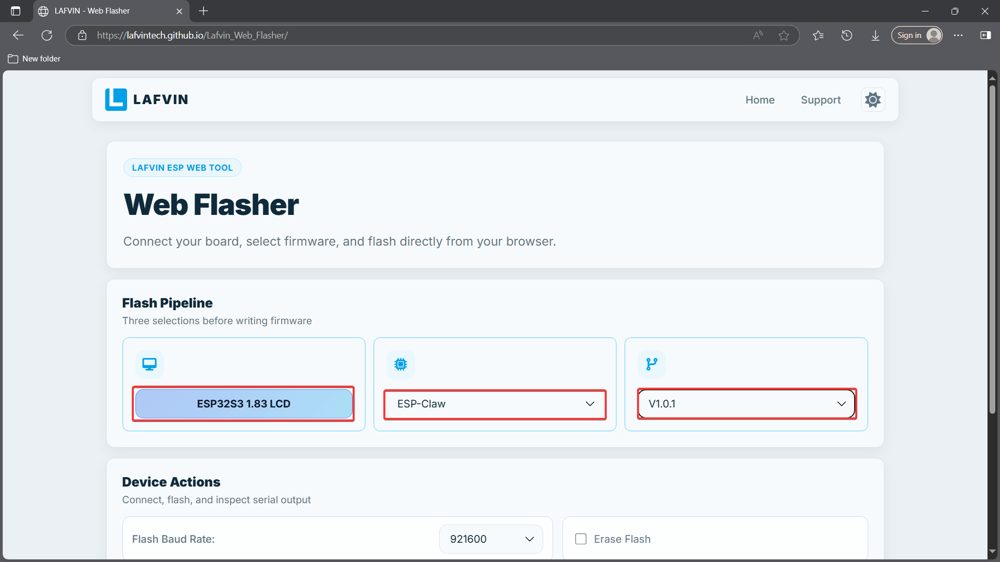
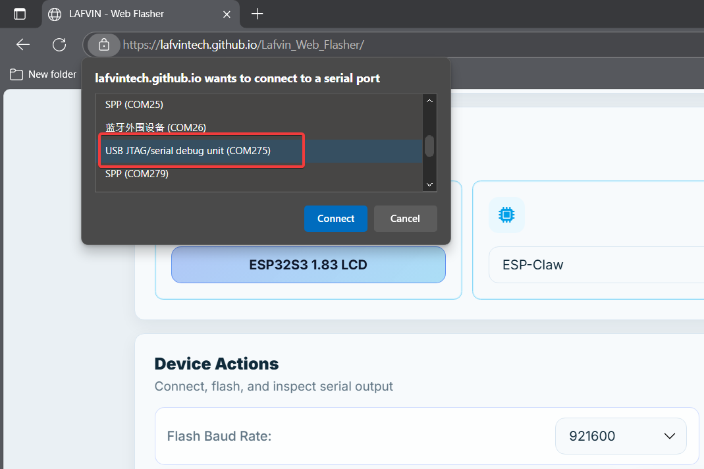
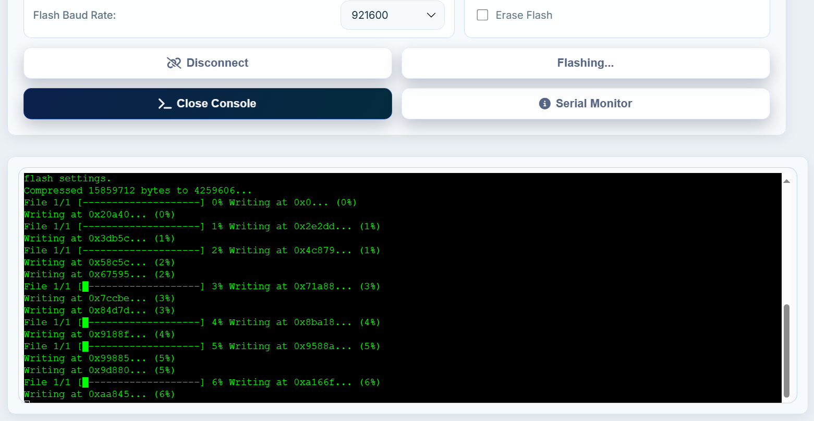
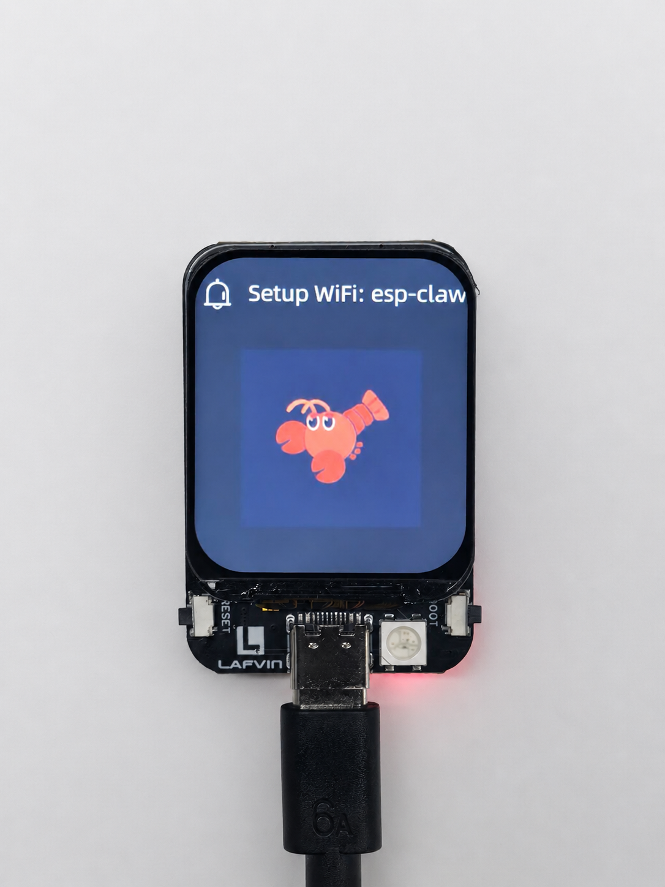
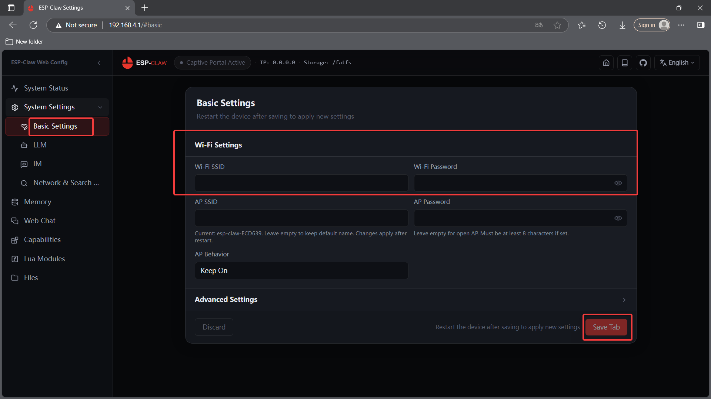
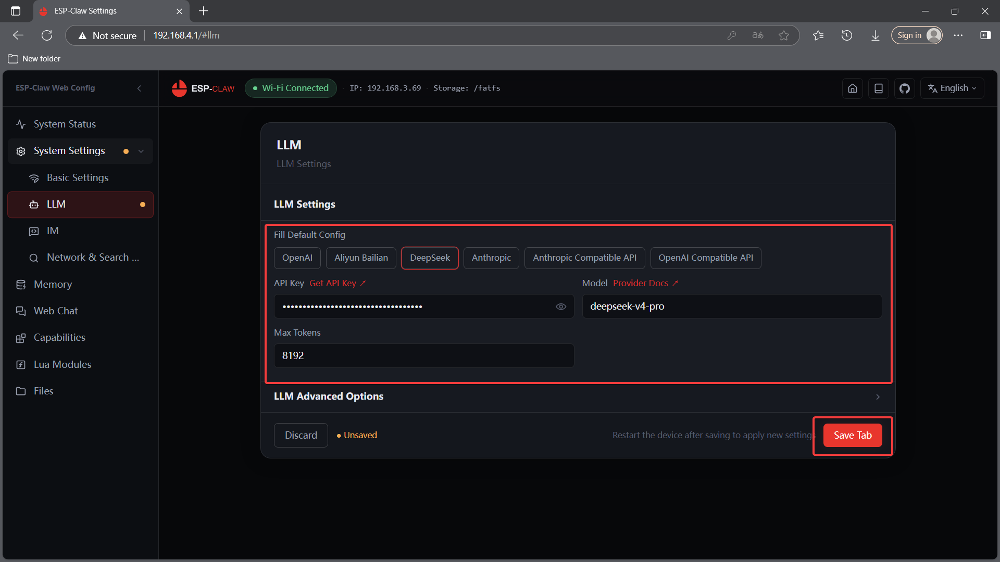
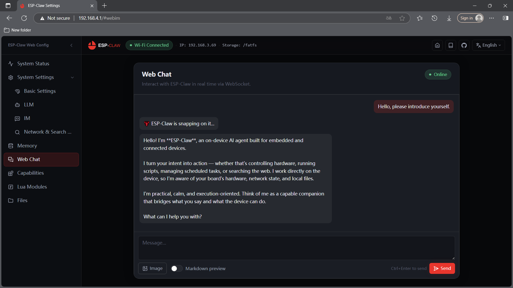

.. _esp_claw:

3. ESP-Claw
================

ESP-Claw is an AI agent firmware for IoT devices such as the ESP32-S3. We have
ported ESP-Claw to the ESP32-S3 1.83-inch LCD Development Board. You can flash
the firmware online first, then configure WiFi, LLM, and optional IM channels
from the web console.

This chapter is not intended to teach ESP-Claw source-code development. It is
focused on the first successful user experience:

* Flash the ESP-Claw firmware for this board
* Connect the board to a 2.4 GHz WiFi network
* Configure an LLM service
* Optionally configure an IM chat channel
* Complete a basic interaction test

.. note::
   If you only want to try the AI agent firmware, follow this chapter. Source
   builds, project architecture, Capability, Lua, Skills, and other advanced
   topics are introduced briefly later and linked to the upstream documentation.

----

What is ESP-Claw
----------------

ESP-Claw turns an embedded device into an AI agent that can interact through
natural language. It can connect to an LLM service, respond to user messages,
react to device events, call local capabilities, and communicate through IM,
the web console, or the serial console.

On this development board, ESP-Claw can use the ESP32-S3 WiFi, Flash, PSRAM,
LCD, and onboard peripherals as a compact AIoT experiment platform.

Common use cases include:

* Chatting with the device from the web console
* Interacting with the device through IM platforms such as WeChat, Feishu,
  Telegram, or QQ Bot
* Asking the device to run simple tasks, query information, or call enabled
  capabilities
* Adding Skills, Lua scripts, or custom capabilities in advanced use cases

For the upstream project documentation, see:
`ESP-Claw Docs <https://esp-claw.com/en/tutorial/>`_

----

Before You Begin
----------------

Prepare the following items:

* ESP32-S3 1.83-inch LCD Development Board
* USB Type-C data cable
* Chrome, Edge, or another Chromium-based browser
* 2.4 GHz WiFi SSID and password
* A valid LLM API key

.. warning::
   LLM services are usually provided by third-party platforms and may incur
   charges. Keep your API key private, and check your account quota, billing
   model, and usage limits before using it. Do not expose API keys in screenshots,
   forums, issues, or public repositories.

.. attention::
   Use a USB data cable. A charging-only cable can power the board, but it cannot
   be used for online flashing or serial communication.

----

Flash ESP-Claw Firmware
-----------------------

ESP-Claw can be flashed from a browser. Online flashing is the recommended path
for the first experience and is also useful when you need to recover from an
incorrect configuration.

Open the online flasher with Chrome or Edge:

`ESP-Claw Online Flasher <https://lafvintech.github.io/Lafvin_Web_Flasher/>`_

Follow these steps:

1. Connect the board to your computer with a USB Type-C data cable.
2. Click **Connect**. In the browser serial-port dialog, select
   **USB JTAG/serial debug unit (COMxxx)**. The COM number may be different on
   your computer.

3. On the flashing page, select ``ESP32S3 1.83 LCD`` and the ESP-Claw firmware
   for this board.

4. Click **Flash** and wait for the progress to finish.

5. After flashing is complete, the board will reboot automatically.

.. note::
   If the browser says that Web Serial API is not supported, switch to Chrome,
   Edge, or another Chromium-based browser. Firefox usually cannot be used for
   online flashing.

----

First Boot
----------

After flashing, press the **Reset** button on the board. The board will boot
into ESP-Claw. The LCD will show the lobster image, and the top banner will show
the AP name.

Use a phone or computer to connect to this WiFi AP, then open ``192.168.4.1`` in
a browser to enter the configuration page. Continue with the configuration steps
below.

----

Configure WiFi
--------------

WiFi is required for ESP-Claw to use LLM, IM, and online search features. Configure
WiFi first.

Configure WiFi From the Device AP
^^^^^^^^^^^^^^^^^^^^^^^^^^^^^^^^^

After online flashing, connect to the WiFi AP shown on the LCD. Then open
``192.168.4.1`` in a browser. On a phone, the configuration page may open
automatically.

Go to **System Setting > Basic Setting > WiFi Setting**, enter the SSID and
password of your 2.4 GHz WiFi network, then click **Save Tab**. The board will
restart.

Reconnect to the board AP. You should be able to see that the board is connected
to your local network and has obtained an IP address.

.. note::
   This board uses ESP32-S3. Use a 2.4 GHz WiFi network.

----

Configure LLM
-------------

LLM is the core of ESP-Claw. After configuring an LLM service, the device can
understand natural language, generate replies, and call capabilities based on
context.

Configure it from the web console:

#. Connect to the board AP and open the configuration page.
#. Go to **System Settings > LLM**.
#. Several common LLM provider presets are available. Select one provider.
#. Enter the model API key and model name. For example, if you use DeepSeek, you
   only need to enter the API key, then click **Save Tab**. You can then chat
   with the LLM from the **Web Chat** page.

.. warning::
   API keys, model names, quotas, and billing rules are different for each LLM
   platform. Follow the official documentation for your selected provider. If
   the model name or Base URL is incorrect, the board may be online but unable
   to reply normally.

----

Optional: Configure IM
----------------------

IM configuration is optional. If you only want to try ESP-Claw in a browser, use
the web console chat page first and skip IM for now.

If you want to interact with the device through a chat application, open
**System Settings > IM** in the web console. ESP-Claw supports IM channels such
as:

* WeChat
* QQ
* Feishu
* Telegram

Different IM channels require different settings:

.. list-table::
   :header-rows: 1
   :widths: 28 42 30

   * - IM channel
     - Common settings
     - Required
   * - WeChat
     - Scan the QR code or follow the page instructions
     - Optional
   * - QQ Bot
     - App ID, App Secret
     - Optional
   * - Feishu
     - App ID, App Secret
     - Optional
   * - Telegram
     - Bot Token
     - Optional

For detailed IM setup instructions, refer to:

* `IM Settings <https://esp-claw.com/en/tutorial/web-config/#im-settings>`_

----

Optional: Search API
--------------------

Online search is optional. After configuring a search API, ESP-Claw can retrieve
online information and use it for tasks that need up-to-date data.

In the web console, go to **System Settings > Network & Search Config**, then
enter the API key for the service you want to use.

.. note::
   If you do not configure a search API, basic chat and local capabilities can
   still be used, but the device may not be able to retrieve current online
   information.

----

ESP-Claw Feature Overview
-------------------------

After WiFi, LLM, and basic chat are working, you can continue exploring ESP-Claw's
extended features. These features are not required for the first experience.

.. list-table::
   :header-rows: 1
   :widths: 24 48 28

   * - Feature
     - What it does
     - Best for
   * - Skills
     - Skills are task templates or functional packages that can be called by
       the AI to extend what the device can do.
     - Running more specific tasks from natural language
   * - Memory management
     - Manages saved context, preferences, or long-term information so later
       conversations can better match the user's habits.
     - Remembering user preferences or long-term context
   * - Capability
     - Capability abstracts low-level device functions, such as controlling
       hardware, reading status, or calling local features.
     - Exposing new hardware functions to the AI
   * - Lua
     - Lua modules provide lightweight logic extensions without rewriting the
       main firmware.
     - Quickly testing custom behavior
   * - File management
     - The web console can manage some files, scripts, and resources stored on
       the device.
     - Updating scripts, resources, or checking device files
   * - Console
     - Console can be used to view runtime status, debug output, or run some
       commands.
     - Troubleshooting and observing runtime behavior

.. attention::
   These features are for advanced use. Most users only need WiFi, LLM, and
   optional IM configuration to experience ESP-Claw. Before changing Skills,
   Capability, Lua modules, or device files, back up the current configuration.

For more information, see the ESP-Claw documentation:

* `Web Console Guide <https://esp-claw.com/en/tutorial/web-config/>`_
* `Skills Lab <https://esp-claw.com/en/tutorial/skills-lab/>`_
* `ESP-Claw Docs <https://esp-claw.com/en/tutorial/>`_

----

Troubleshooting
---------------

Cannot Find Serial Port
^^^^^^^^^^^^^^^^^^^^^^^

* **Symptom**: The online flasher cannot show or select a serial port.
* **Possible Causes**: Charging-only USB cable, unsupported browser, or the port
  is occupied by another program.
* **Solutions**: Use a USB Type-C data cable, use Chrome or Edge, and close tools
  such as Arduino IDE Serial Monitor that may be using the port.

Flashing Fails
^^^^^^^^^^^^^^

* **Symptom**: Flashing fails or the progress stops.
* **Possible Causes**: Serial connection is interrupted, the board is not in
  download mode, or browser permission failed.
* **Solutions**: Reconnect the serial port and flash again. If needed, hold
  **BOOT**, press **RST** briefly, release **BOOT**, then connect again.

WiFi Cannot Connect
^^^^^^^^^^^^^^^^^^^

* **Symptom**: The device cannot connect to the network.
* **Possible Causes**: Wrong SSID or password, 5 GHz WiFi, or router restrictions
  for new devices.
* **Solutions**: Use a 2.4 GHz WiFi network, enter the SSID and password again,
  or connect to the SoftAP and update the settings from the web console.

LLM Does Not Reply
^^^^^^^^^^^^^^^^^^

* **Symptom**: The device is online, but chat does not reply or reports a call
  failure.
* **Possible Causes**: Wrong API key, no account quota, wrong model name, or
  wrong Base URL.
* **Solutions**: Check the LLM provider dashboard, copy the API key again, and
  confirm that the model name and Base URL match the provider documentation.

----

Advanced: Modify the Project
----------------------------

This chapter only covers the user experience path. If you want to modify the
ESP-Claw source code, add new Capability modules, write Lua modules, adjust
Skills, or port ESP-Claw to other hardware, continue with the upstream project
documentation:

* `ESP-Claw Docs <https://esp-claw.com/en/tutorial/>`_
* `Build and Flash From Source <https://esp-claw.com/en/reference-project/build-from-source/>`_
* `Web Console Guide <https://esp-claw.com/en/tutorial/web-config/>`_

.. note::
   Source-code development requires ESP-IDF, C/C++, embedded debugging, and
   network service configuration experience. General users should first use
   online flashing and the web console, then explore source development if they
   are interested.
