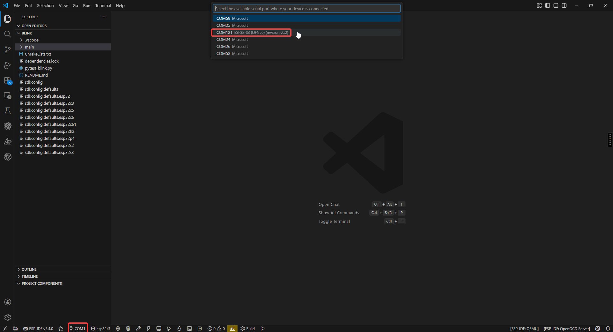
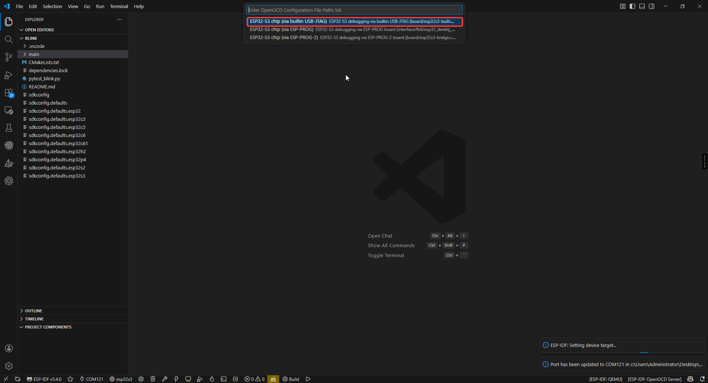
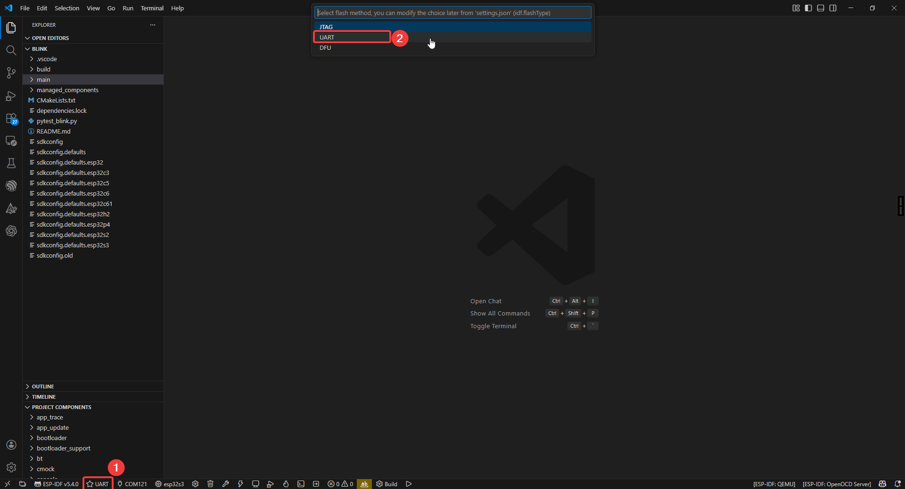

.. _esp_idf:

3. ESP-IDF
=================

First, in this section, we need to configure the IDF development environment. You can follow the chapters below for installation.

:ref:`Install ESP-IDF <idf_install>`

After installing VSCode and IDF as per the tutorial, We're ready to start configuring the project.

Project Configuration
-----------------------------------
First, you need to configure the COM port, Flash Method and chip model (using esp32s3 as an example).

.. image:: img/idf_conf2.png

Project Structure
-----------------
.. image:: img/idf_project.png

1. Project-level configuration (root directory):
    CMakeLists.txt: The core configuration file for project building.
     • Specifies the target chip platform (e.g., ESP32/ESP32-S3)
     • Manages project component dependencies
     • Configures global compile parameters (optimization levels, macros, etc.)
     • Sets up the cross-compilation toolchain

2. Project configuration system:
    sdkconfig: Instantiated file for project build configuration
     • Stores all configuration options from menuconfig
     • Includes critical parameters such as chip model, function modules, switches, etc.
     • Auto-generated, recommended to be modified via idf.py menuconfig

3. Application core (main directory):
    main.c: System entry file
     • Must implement the app_main() entry function
     • Plays a similar role to main()
     • The first code executed after system startup
    CMakeLists.txt: Component-level build configuration
     • Specifies the collection of source files
     • Sets header file search paths
     • Defines component dependencies

4. Storage management:
    partitions.csv: Flash storage layout definition
     • Configures partition types, start addresses, and sizes
     • Supports OTA upgrade scheme design
     • User data areas can be customized

5. Component management system (components directory):
    Built-in components: such as drivers, protocol stacks, etc.
    Third-party components: e.g., LVGL graphics library
    Custom components: project-specific functional modules

Each component follows a standard structure including:
 • Build configuration file (CMakeLists.txt)
 • Configuration options (Kconfig)
 • Source code implementation (src/)

.. image:: img/idf_workflow.png

Start Compiling and Flashing
----------------------------------
First, open VSCode and select the project example folder.

.. image:: img/idf_conf4.png

Select the example provided under ESP-IDF and click to select the folder (in the path where you downloaded the code).

.. .. image:: IDF选择文件夹图片(暂时空着)

Connect the device, select the correct COM port and model, and click the flame icon below to compile and flash it.

.. image:: img/idf_conf5.png

Sample Program
----------------------

hello_world
^^^^^^^^^^^^^^

Use Type-C Cable connect the board to your computer.

Code Analysis
"""""""""""""""

.. code-block:: C

    void app_main(void)
    {
        ESP_LOGI(TAG, "Hello World - ST7789 Display Demo");

        /* Print chip info to serial console (keep original functionality) */
        esp_chip_info_t chip_info;
        esp_chip_info(&chip_info);
        printf("Chip: %s, %d core(s), rev v%d.%d\n",
            CONFIG_IDF_TARGET, chip_info.cores,
            chip_info.revision / 100, chip_info.revision % 100);

        /* Initialize the LCD display */
        esp_err_t ret = lcd_init();
        if (ret != ESP_OK) {
            ESP_LOGE(TAG, "LCD init failed: %s", esp_err_to_name(ret));
            return;
        }

        /* Clear screen to black */
        lcd_fill_screen(COLOR_BLACK);

        /* Show chip information on the display */
        show_chip_info_on_lcd();

        /* Keep the display on, refresh heap info periodically */
        while (1) {
            vTaskDelay(pdMS_TO_TICKS(5000));
            ESP_LOGI(TAG, "Free heap: %" PRIu32 " bytes", esp_get_minimum_free_heap_size());
    }

- ``app_main()``: User application entry point.
- ``esp_chip_info()``: Retrieves the chip model, number of cores, and features. It populates the esp_chip_info_t structure with information including WiFi/BT/BLE support status and silicon version.
- ``esp_flash_get_size()``: Retrieves the Flash memory capacity. Called within the `show_chip_info_on_lcd` function to detect the size of onboard or external Flash (in bytes).
- ``vTaskDelay()``: FreeRTOS non-blocking delay.
- ``esp_restart()``: Software restart. While this LCD example ultimately uses an infinite loop, in standard Hello World implementations, this function is typically called after a countdown to reboot the entire SoC.

Run Result
"""""""""""""""
After compiling and burning the firmware, open the monitor to view the hardware chip and memory information displayed on the LCD.

.. image:: img/idf/hello_world.jpg

blink
^^^^^^^^^^^^^^

Use Type-C Cable connect the board to your computer.

Code Analysis
"""""""""""""""

.. code-block:: C

    static uint8_t s_led_state = 0;

    void app_main(void)
    {
        configure_led();  // Initialize LED (GPIO or RGB Strip)

        while (1) {
            ESP_LOGI(TAG, "Turning the LED %s!", s_led_state ? "ON" : "OFF");
            blink_led();              // Toggle LED
            s_led_state = !s_led_state;
            vTaskDelay(CONFIG_BLINK_PERIOD / portTICK_PERIOD_MS);
        }
    }

- Supports two LED types: standard GPIO LED and addressable RGB LED (WS2812).
- ``configure_led()``: Initialize LED based on menuconfig settings.
- ``blink_led()``: Set LED on/off state.
- ``CONFIG_BLINK_GPIO``: LED GPIO pin, set via ``idf.py menuconfig``.
- ``CONFIG_BLINK_PERIOD``: Blink interval in ms.

Run Result
"""""""""""""""
After running and burning the code, the WS2812 LEDs on the back of the development board will flash.

.. video:: img/idf/blink.mp4
  :width: 100%

i2s_mic_speaker
^^^^^^^^^^^^^^^^^^

Use Type-C Cable connect the board to your computer.

Code Analysis
"""""""""""""""

.. code-block:: C

    static uint8_t s_led_state = 0;

    void app_main(void)
    {
        configure_led();  // Initialize LED (GPIO or RGB Strip)

        while (1) {
            ESP_LOGI(TAG, "Turning the LED %s!", s_led_state ? "ON" : "OFF");
            blink_led();              // Toggle LED
            s_led_state = !s_led_state;
            vTaskDelay(CONFIG_BLINK_PERIOD / portTICK_PERIOD_MS);
        }
    }

- Supports two LED types: standard GPIO LED and addressable RGB LED (WS2812).
- ``configure_led()``: Initialize LED based on menuconfig settings.
- ``blink_led()``: Set LED on/off state.
- ``CONFIG_BLINK_GPIO``: LED GPIO pin, set via ``idf.py menuconfig``.
- ``CONFIG_BLINK_PERIOD``: Blink interval in ms.
i2s_mic_speaker
^^^^^^^^^^^^^^^^^^

Use Type-C Cable connect the board to your computer.

Code Analysis
"""""""""""""""

.. code-block:: C

    void app_main(void)
    {
        ESP_LOGI(TAG, "I2S Mic & Speaker Echo Demo");

        / 1. Initialize Microphone (I2S RX) and Speaker (I2S TX) /
        ESP_ERROR_CHECK(mic_init());
        ESP_ERROR_CHECK(speaker_init());

        / 2. Create audio processing task pinned to Core 1 for real-time performance /
        xTaskCreatePinnedToCore(echo_task, "echo", 4096, NULL, 5, NULL, 1);
    }

- ``mic_init()``: Initializes I2S0 port in master receive (RX) mode. Configured for 32-bit sample width (24-bit valid) at a 16kHz sample rate for the ICS-43434 microphone.
- ``speaker_init()``: Initializes I2S1 port in master transmit (TX) mode. Configured for 16-bit sample width at a 16kHz sample rate for the MAX98357 amplifier.
- ``echo_task()``: The core logic task. It reads 32-bit raw data from the mic, converts it to 16-bit, stores it in a ring buffer, and plays it back through the speaker after a 3-second delay.
- ``I2S_STD_PHILIPS_SLOT_DEFAULT_CONFIG``: Used to configure the standard Philips I2S slot format, which is the common standard for digital audio communication.
- ``DELAY_SECONDS``: The echo delay duration, defined as 3 seconds. The buffer is prioritized in PSRAM to save internal memory.
- ``clamp16()``: An inline function that safely clamps 32-bit audio data to a 16-bit range, preventing popping sounds or hardware resets during loud transients.

Run Result
"""""""""""""""

When you flash the project and open the Serial Monitor (115200 baud), you will see the following output:

.. code-block:: text

    I (312) i2s_echo: I2S Mic & Speaker Echo Demo
    I (312) i2s_echo: Mic: ICS-43434 (WS=40, SCK=41, SD=42)
    I (322) i2s_echo: Spk: MAX98357  (DIN=45, BCLK=46, LRCLK=47)
    I (332) i2s_echo: Microphone (ICS-43434) initialized on I2S0 RX
    I (342) i2s_echo: Speaker (MAX98357) initialized on I2S1 TX
    I (342) i2s_echo: Echo task started (3 second delay, buffer 96000 bytes)
    ...
    I (3342) i2s_echo: Delay buffer full, playback starting

  Physical Behavior:
   1. Recording: Once the log shows "Echo task started", the ESP32-S3 begins recording audio from the ICS-43434 MEMS microphone.
   2. Buffering: The audio data is stored in a ring buffer (prioritizing PSRAM) for exactly 3 seconds.
   3. Playback: After the 3-second buffer is full, you will hear your recorded voice (or ambient sound) played back through the MAX98357 speaker.
   4. Real-time Loop: The system continues to record and play back with a constant 3-second "echo" effect as long as the board is powered.

.. image:: img/idf/i2s_audio.png

usb_webcam
^^^^^^^^^^^^^^

Use Type-C Cable connect the board to your computer.

This is based on Espressif's official example. The official address is here: https://github.com/espressif/esp-iot-solution

Run Result
"""""""""""""""
After flashing, your ESP32S3 development board will become a UVC camera that can function as a computer webcam.

.. image:: img/idf/uvc_cam.png

Xiaozhi_ai
^^^^^^^^^^^^^^

The download link for the pre-flashed firmware xiaozhi_ai on the development board is provided below. If you're interested in IDF or the project, you can download it and try modifying the configuration to implement more features:

https://drive.google.com/file/d/1Tu95PIAc_TgN5yn74SB_UETjGOM2PxC4/view?usp=sharing
